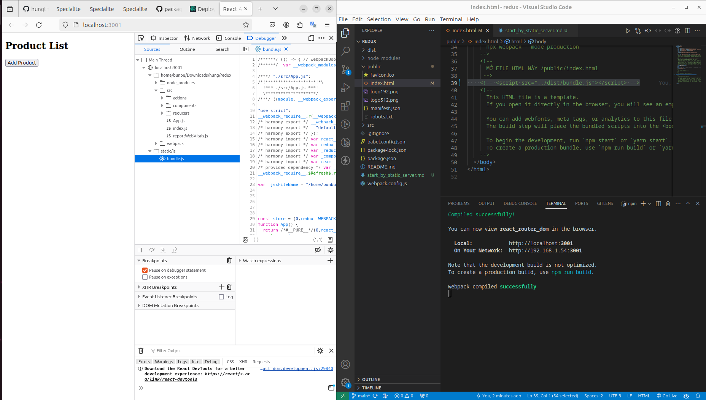
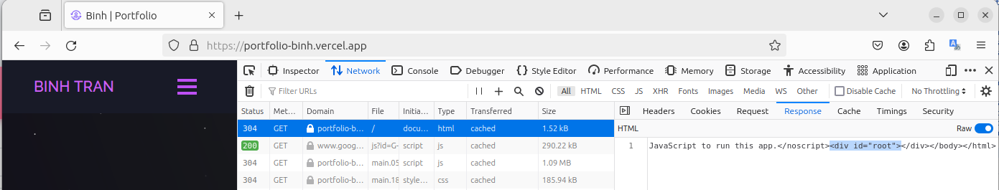
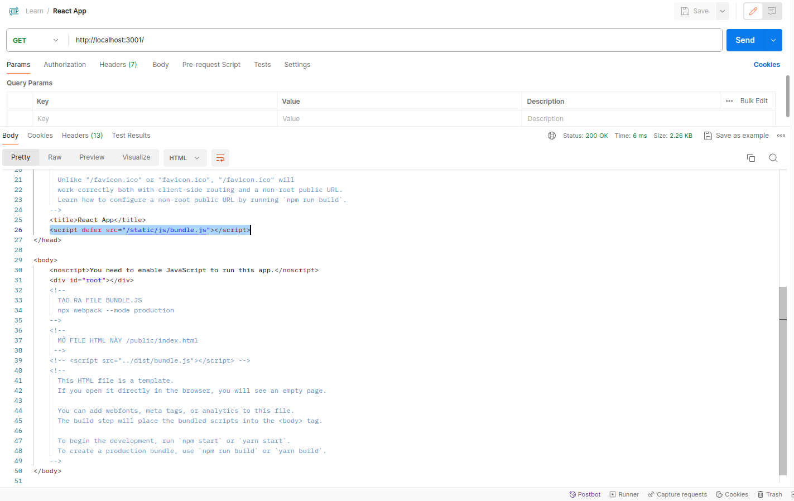
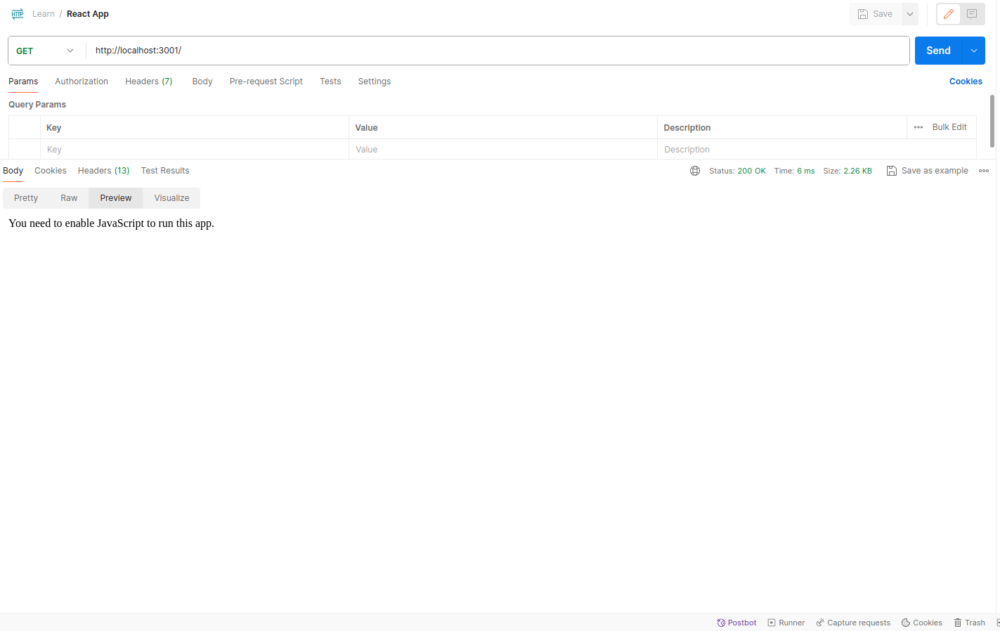

```
npm run start
```
  
bundle.js khi chạy server cổng 3001  
Why does React have a server on its own?  
Angular and React use server to execute development tools: The server that you see is simply to allow for the reloading of the app in response to file changes in real time.  
  
html => thêm các request load thêm js nữa mới nhận về bundle.js được:  
  
  
Postman không request thêm JS - https://github.com/postmanlabs/postman-app-support/issues/2646  
  
