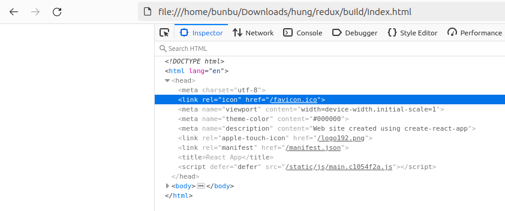
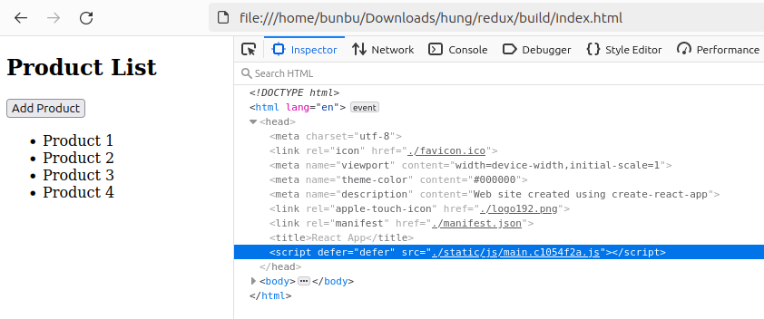

# 1. DOC
https://create-react-app.dev/docs/deployment/  
Other Solutions  
You don’t necessarily need a static server in order to run a Create React App project in production. It also works well when integrated into an existing server side app.  
  
Here’s a programmatic example using Node and Express:  
```js
const express = require('express');
const path = require('path');
const app = express();

app.use(express.static(path.join(__dirname, 'build')));

app.get('/', function (req, res) {
  res.sendFile(path.join(__dirname, 'build', 'index.html'));
});

app.listen(9000);
```

# 2. 
Vậy chỉ cần chạy ```npm run build```  
không chạy ```npx webpack --mode production``` nữa  
rồi dùng ```/build/index.html```  
tuy nhiên khi mở lên:  
  
url này làm file html không hoạt động (với việc mở file) - với một server thì http://localhost:3000/favicon.ico sẽ ok  
sửa file /build/index.html: đổi href=" thành href=". và src=" thành src=".  
họat động ngon:  
  
